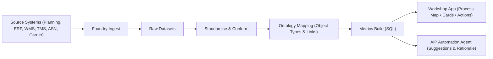

# PO-to-Fulfillment Control Tower | Built in Palantir Foundry + AIP

> A practical, line-level control tower that stitches planning → buying → procurement → logistics → receipt into a single operational view, with an actionable Workshop App and an AIP automation agent for guided decisions.

[](#)

---

## Overview
This project demonstrates an end-to-end **PO-to-Fulfillment Control Tower workflow** built entirely within **Palantir Foundry**, powered by **AIP Logic**.

It unifies fragmented planning and execution data—from demand forecasts and purchase orders to shipments, receipts, and allocations—into a single ontology and applies AIP reasoning to generate real-time operational recommendations.  
**PO-to-Fulfillment Control Tower** treats each *PO line* as the atomic “case” to track end-to-end. Every upstream system tells part of the story; Foundry translates them into a single language (ontology) and surfaces **actionable** insights in a **Workshop App**, while an **AIP automation agent** proposes next-best-actions based on live context and user inputs.

The goal: enable planners and sourcing managers to move from *reactive monitoring* to *proactive decision-making*.

---

## Demo
Watch the full 4-minute demo here:  
<a href="https://www.youtube.com/watch?v=44KYtZuDBko">  </a><br> <a href="https://www.youtube.com/watch?v=44KYtZuDBko">  </a>

---

## Business Context
In complex global supply chains, every Purchase Order travels across multiple systems—ERP, WMS, freight tracking, and allocation engines—each producing its own version of the truth.  
The result: fragmented visibility, inconsistent timestamps, and delayed decisions.

This workflow re-imagines that process in Foundry:
- **Plan:** Capture demand forecasts by SKU, DC, and week.  
- **Buy:** Issue purchase orders and normalise them as standard `PurchaseOrderLine` objects.  
- **Execute:** Track the flow from vendor shipment to warehouse receipt and final allocation.  
- **Decide:** Use AIP Logic to recommend corrective actions such as *expedite*, *reallocate*, or *escalate*.

---

## Architecture Overview



Key Layers:

| Layer                           | Description                                                                                                                                                                                                                            |
| ------------------------------- | -------------------------------------------------------------------------------------------------------------------------------------------------------------------------------------------------------------------------------------- |
| **1. Data Ingestion**           | Source data from Planning, ERP, WMS, and Allocation systems covering Purchase Orders, Shipments, Receipts, and Allocations.                                                                                                            |
| **2. Transformation Pipelines** | Standardize and clean each domain dataset, cast timestamps to UTC, compute durations (Ex-Factory→Hub, Hub→DC, Ex-Factory→DC), and flag SLA breaches.                                                                                   |
| **3. Event Log Construction**   | Build a single “movie reel” per PO line with schema: `event_id`, `po_line_id`, `event_type`, `event_ts`, `source_system`, `is_authoritative`, `note`. Apply precedence + dedupe rules (e.g., Receipt > Shipment for DC arrival).       |
| **4. Metrics Object**           | SQL transformations producing per-PO-line KPIs: `lead_time_days`, `cycle_time_days`, `is_late`, `sla_risk_score`, `value_at_risk`, `current_stage`, `most_recent_event_type/date`. This object feeds both the dashboard and AIP Logic. |
| **5. Ontology Modeling**        | Central object `PurchaseOrderLine` linked to `MetricsTable`, `EventLog`, `Shipment`, `Receipt`, and `Allocation`. Configure **filter propagation** from PO Line to linked datasets.                                                    |
| **6. AIP Logic Function**       | A reasoning agent that consumes a `po_line_id`, fetches context via the ontology, and returns a structured recommendation (`recommended_action`, `rationale_md`, `confidence`, `expected_impact_value`).                               |
| **7. Workshop App**             | One-page control tower: KPI cards, process map, PO table, and an AIP panel. Row click sets `selectedPOLineID` → passed to AIP Logic → recommendation displays inline.                                                                  |


---

## Example Process Flow

- Plan → Buy → Execute → Decide
- ForecastLine → PurchaseOrderLine → Shipment (ExFactory) → Receipt (ReceivedDC) → Allocation (Allocated) → AIP Logic Recommendation
- ExFactory (from Shipment; ASN-backed entries considered more reliable)
- ReceivedHub (optional; from Shipment; non-authoritative)
- ReceivedDC (authoritative; from Receipt, overrides Shipment DC timestamps)
- Allocated (authoritative; from Allocation)

Precedence + dedupe ensure one authoritative event per type/day so KPIs and process mining remain stable and explainable.

---

## AIP Logic Design

- Input: po_line_id (string)
- The goal is to reduce delay risk and protect margin
- Context pulled via ontology: Metrics (lead/cycle time, risk, VaR), last N Events with timestamps, Shipment (mode, ETA, cost), Receipt (qty/date), Allocation (site/channel/date)
- Decision set:
    - EXPEDITE
    - SPLIT_SHIPMENT
    - PUSH_PROMISE_DATE
    - REALLOCATE_FROM_STORE
    - ESCALATE_TO_VENDOR
    - NO_ACTION
- Output (strict JSON keys): recommended_action, rationale_md, confidence, expected_impact_value

Sample Output
```
{
  "recommended_action": "ESCALATE_TO_VENDOR",
  "rationale_md": "Short-received vs order; DC receipt confirmed; allocation blocked. Escalation protects availability and margin.",
  "confidence": 0.92,
  "expected_impact_value": 12500
}
```
---

## Impact

| Problem Before                        | What This Delivers                                                         |
| ------------------------------------- | -------------------------------------------------------------------------- |
| Fragmented spreadsheets & systems     | Unified ontology linking plan, buy, and execution domains                  |
| Conflicting timestamps across sources | Precedence + dedupe rules consolidated in a single Event Log               |
| No trustworthy lead/cycle times       | SQL-engineered Metrics Object with standardized KPI logic                  |
| Reactive firefighting                 | AIP Logic recommends proactive, explainable actions with confidence scores |
| Low data trust                        | Transparent lineage, consistent filters, and ontology-aware visuals        |


---

## Next Steps

- Ontology Actions / Write-back: apply recommendations (update promise date, create supplier task) directly from the app and log to an audit dataset.
- Batch Reasoning: score/prioritize hundreds of PO lines under budget or service constraints (e.g., maximize service for a given expedite cap).
- Proactive Alerts: notify planners when value_at_risk or delay probability breaches thresholds.
- Extend the Model: include inventory positions and allocation plans to close the loop from plan → execution → re-plan.

---

## Key Takeaways

- Unified planning, procurement, and execution in a single, filter-aware ontology.
- Engineered a reusable Metrics Object via SQL for precise, explainable KPIs.
- Built a Workshop control tower that embeds AIP Logic for prescriptive decisions in-context.
- Designed for planners and sourcing managers to act faster with confidence, moving from visibility to decision to action in one workspace.

---
